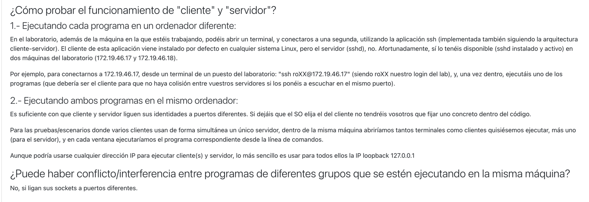
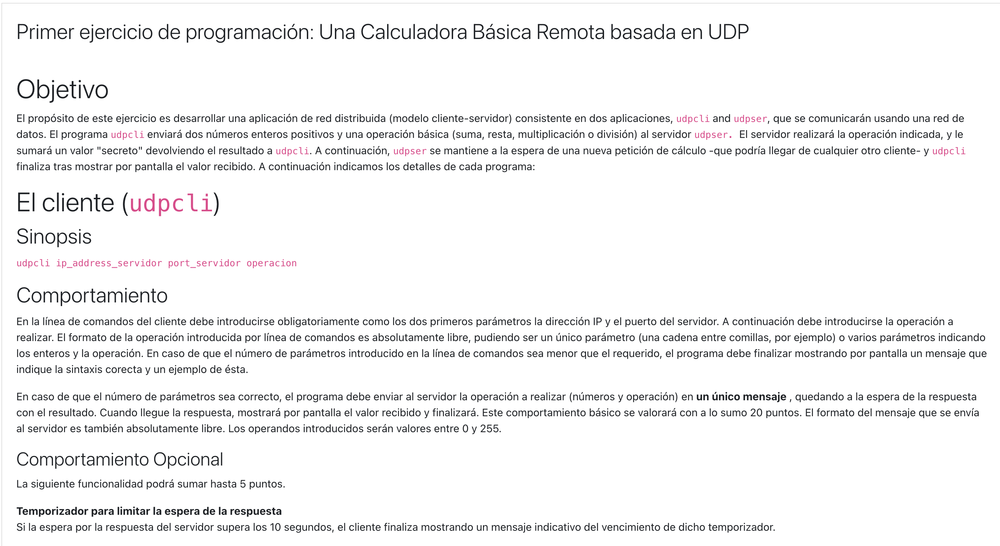
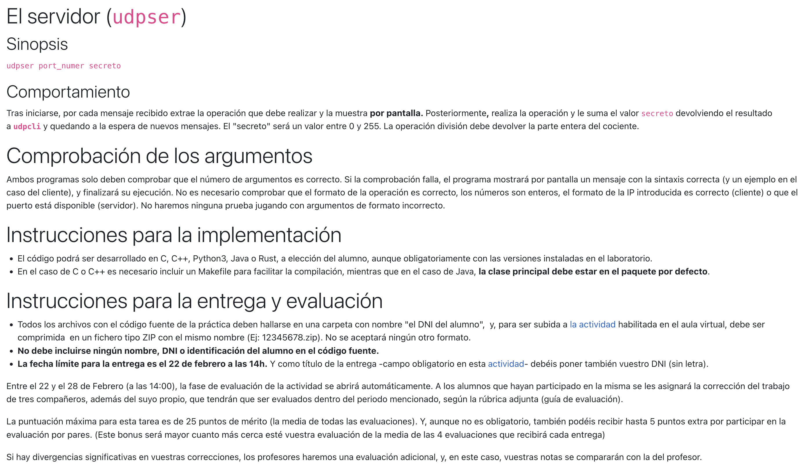

# upd-calculator-tester
To my dear classmates 💖,

## ⚠️BIG DISCLAIMER HERE

This repository is to you not to start from the scratch BUT bear in mind this is not an official tool for validation.
Your teachers and other classmates WON'T use this tool for validation.
TRY THIS ON YOUR OWN!

## 🫠What this repo is trying to do?



I've created this repo for testing our applications easily. You can clone this repo and start from there, copy the files or do whatever!
Bear in mind if you fork it you will open a **public repo**. My suggestion is to open a private one and upload all this files!

I've created two different modules, so you can start from there but, please, keep in mind this is not the path the teachers want: 
You will need to copy JUST the .java to the folder you will submit.

- [updcli](client/src/main/java/udpcli.java) is where your client application starts.
- [updser](server/src/main/java/udpser.java) is where your client application starts.

## 🏃How to run

I've created a [GoldenTest](src/test/java/GoldenTest.java) that runs in a thread the server behind server module main method.
And uses udpcli mainSync to try the UDP connection.

For a simple local validation just execute:
```./gradlew clean build```
(You just need to have installed jdk11)

But also I've set up a GitHub action gradle workflow, that means, on every single commit a pipeline will execute all the tests you create!
The good part here: it's using laboratory OS (ubuntu 22.04 and the OpenJDK 11.0.17(from Terumin))

## ✉️ What do I need to submit?

[This script](generate_submit.sh) will copy all the files (recursively) from client/server paths and ".zip" them.
Please rename the file with your ID or run with your ID as parameter (it will generate the file with that name).

`./generate_submit.sh`

`./generate_submit.sh my-id`

BUT PLEASE DON'T YOLO: unzip and try it out the times you consider.

## 🤔 Areas to improve

- For sure this verification is too simple, there is no network hops but at least it's something.
- It's not java agnostic (yet)


Any feedback is more than welcome, PRs too!

Thanks 🤓

[Check the requirements here](REQUIREMENTS.md)



